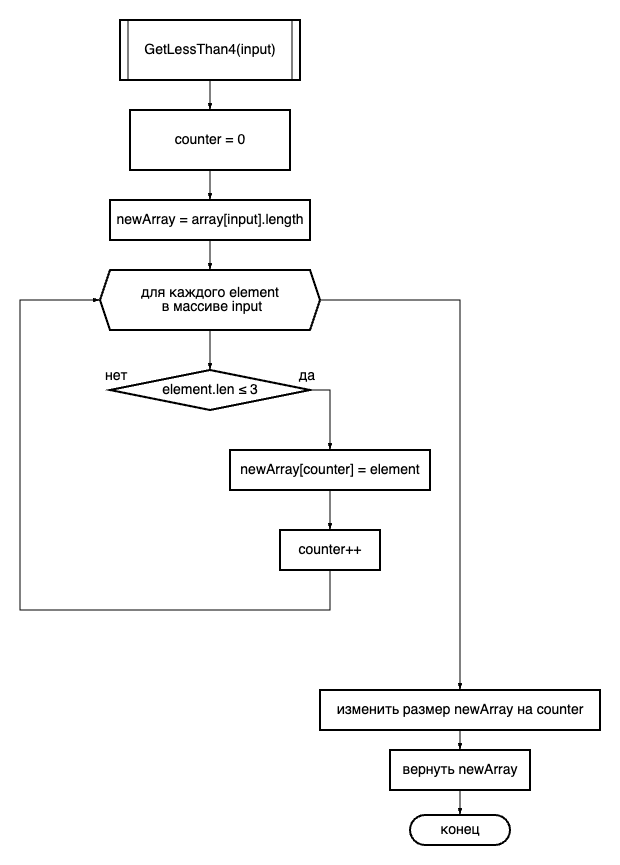

# Задача
Написать программу, которая из имеющегося массива строк формирует массив из строк, длина которых меньше либо равна 3 символа. Первоначальный массив можно ввести с клавиатуры, либо задать на старте выполнения алгоритма. При решении не рекомендуется пользоваться коллекциями, лучше обойтись исключительно массивами.
# Решение
Создадим метод принимающий на вход и возвращающий строковый массив

Задаим первоночальный массив равный по размеру исходному и счетчик = 0

В этом методе пройдемся по всем элементам, и при выполннении условия(длина строки <= 3)
сохраним элемент в новом массиве под номером равным счетчику, и увеличим счетчик 

После оконочания цикла изменим с помощью встроенного метода Array.Resize
размер массива до размера счетчика

Вернем получившийся массив из метода

## Блок-схема данного алгоритма
